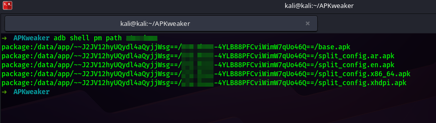

APKWeaker

APKWeaker is a command-line tool designed to simplify the process of modifying Android APKs for testing and debugging purposes
It automates the process of pulling APKs from the Android emulator, decompiling them, injecting `networkSecurityConfiguration` into the `base.apk`  if the application uses Split Packages to allow `ClearTextTraffic` (HTTP), forcing the application to trust a certificate (user, system), rebuilding the APKs, and signing them for reinstallation </br>
</br>
This tool is particularly useful for security researchers, developers, and testers who need to bypass network security restrictions in a controlled environment

**⚠️ Warning:** This Tool Is intended For Ethical Use In Testing And Development Environments Only,
Modifying APKs Or Enabling Cleartext Traffic May Introduce security risks. Use responsibly and ensure compliance with applicable laws and terms of service

## Features

**Automated APK Pulling:** Extracts APKs (base and split) from an Android emulator using ADB
Decompilation: Uses `apktool` to decompile APKs for modification
Network Security Modification: Adds or updates the networkSecurityConfig in the base APK's AndroidManifest.xml to allow cleartext traffic

**Rebuilding:** Rebuilds modified APKs with apktool using aapt2 for proper resource handling
</br>
**Signing:** Signs all APKs using `uber-apk-signer` for compatibility with Android devices
</br>
**Backup:** Creates a backup of decompiled APKs before modifications </br>
**Error Handling:** Robust checks to ensure each step completes successfully

## Prerequisites
**Before using APKWeaker, ensure the following are installed:**

**ADB (Android Debug Bridge):** For pulling APKs from an emulator </br>
**Java:** OpenJDK 17 or higher for running `apktool` and `uber-apk-signer`
**xmlstarlet:** For modifying XML files(AndroidManifest.xml)</br>
**apktool:** Version 2.11.1 or higher (download apktool_2.11.1.jar)</br>
**uber-apk-signer:** Version 1.3.0 or higher (download uber-apk-signer-1.3.0.jar)</br>
**Linux-based System:** The script is designed for Linux with apt package manager

## Installation
```
Clone the Repository:
git clone https://github.com/yourusername/APKWeaker.git
```

## Usage

**Configure the Script:**
```
./script.sh
[+] Enter The Package Name / com.ex.app: com.meta.whatsapp
[+] Enter The Serial Emulator / adb devices: 127.0.0.1:5555
```

### Output:

- **Pulled APKs:** Stored in Original_APKs </br>

- **Decompiled APKs:** Stored in Updated_Decompile </br>

- **Automatically Update**: Update AndroidManifest - Network Configuration </br>

- **Automatically Signature**: Signature All APK's Again </br>


```
Directory Structure
APKWeaker/
├── requirements/
│   ├── apktool_2.11.1.jar
│   ├── uber-apk-signer-1.3.0.jar
├── apkweaker.sh
├── $PACKAGE_NAME/
│   ├── Original_APKs/          # Pulled APKs from emulator
│   ├── Updated_Decompile/      # Decompiled APKs with modifications
│   ├── Original_Decompile/     # Backup of decompiled APKs
│   ├── Updated_APKs/           # Rebuilt APKs
│   ├── Signed_APKs/            # Signed APKs
│   ├── Signed_Keys/            # Signature files (.idsig)
```
### Contributing
**Contributions are welcome! To contribute:**
- Fork the repository
- Create a new branch (git checkout -b feature/your-feature)
- Make your changes and commit (git commit -m "Add your feature")
- Push to the branch (git push origin feature/your-feature)
Open a pull request

### License
This project is licensed under the MIT License. See LICENSE for details
Acknowledgements
